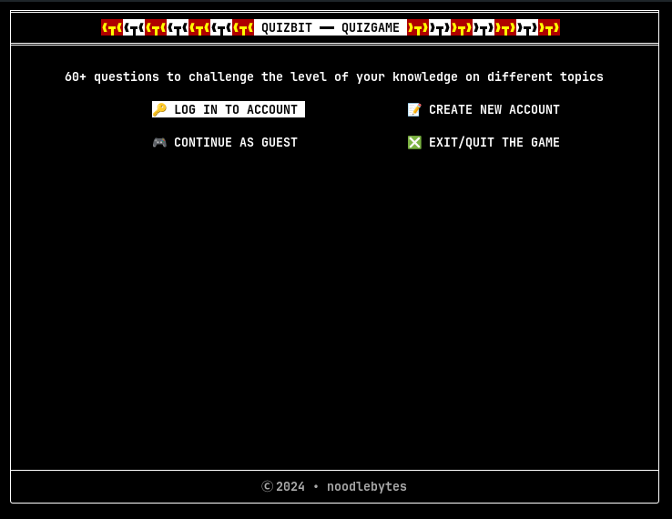

<hr>
<div align="center">
   

<h1>QUIZBIT - QUIZ GAME</h1>
<p><em><code>► CLI based quiz game written in C</code></em></p>
<!--<p>
	
	
	
	
</p>-->

<p style="text-align: center"><em>Softwares/Technologies Used</em></p>
<p><strong>CLION ┃ SQLite3 ┃ OpenSSL ┃ CMake ┃ Makefile ┃ valgrind </strong></p>
</div>

<hr>


<div id="quick-links">
<details>
<summary style="font-size: large"> <strong> 🔗 Table Of Contents </strong></summary>
<blockquote>
<ul>
    <li><a href="#overview">📍 Overview</a></li>
    <li><a href="#features">📦 Features</a></li>
    <li><a href="#repo-structure">📂 Repository Structure</a></li>
    <li><a href="#modules">🧩 Modules</a></li>
    <li><a href="#get-started">🚀 Getting Started</a><ul>
    <li><a href="#installation">⚙️ Installation</a></li>
    </ul>
    </li>
    <li><a href="#usage">🚀 Usage</a></li>
    <li><a href="#contribute">🤝 Contributing</a></li>
    <li><a href="#license">📄 License</a></li>
    <li><a href="#acknowledgments">👏 Acknowledgments</a></li>
</ul>
</blockquote>
</details>

<hr>

<h2 id="overview"> 📍 Overview </h2>
    <ul>
      <p style="text-align: justify">
        This project is a CLI Quiz Game written in C as my final project for the CS50x course.
        It is designed to test user's knowledge across three categories: Science, Sports, and General Knowledge.
        Users can log in to an existing account or sign up for a new one, and their progress is saved in an SQLite database.
        This project demonstrates proficiency in C programming, database management, and basic security practices.
    </p>
   </ul>
</div>

<hr>

<div>
<h2 id="features"> 📦 Features </h2>
<ul>
<details>
    <summary style="font-size: 15px"> User Authentication </summary>
    <ul>
    Users can log in to their account or create a new one through the sign-up process
    </ul>
</details>

<details>
    <summary style="font-size: 15px"> Quiz Categories </summary>
    <ul>
    The game offers three categories — Science, Sports, and General Knowledge. Users can choose any category to start the quiz.
    </ul>
</details>

<details>
    <summary style="font-size: 15px"> Randomized Questions </summary>
    <ul>
    Questions are randomly selected from the chosen category to ensure a unique experience each time.
    </ul>
</details>

<details>
    <summary style="font-size: 15px"> Score Tracking </summary>
    <ul>
        The game records user scores and allows users to view their scores in their profile.
    </ul>
</details>

<details>
    <summary style="font-size: 15px"> Profile Management</summary>
    <ul>Users can view their profile, edit their information, delete their account, or reset their profile data.</ul>
</details>
</ul>

<hr>

<details>
<summary id="repo-structure" style="font-size: 20px"> 📂 Repository Structure </summary>

```
.
├── config
│   ├── build.sh
│   ├── CMakeLists.txt
│   ├── install_requirements.sh
│   └── requirements.txt
├── docs
│   ├── img
│   │   └── qmark.png
│   └── README.md
├── include
│   ├── console.h
│   ├── db.h
│   ├── emojis.h
│   ├── gamecore.h
│   ├── gamemath.h
│   ├── global.h
│   └── utilities.h
├── LICENSE
└── src
    ├── console
    │   └── terminal.c
    ├── core
    │   ├── account.c
    │   ├── gamecore.c
    │   ├── gamemath.c
    │   ├── gameplay.c
    │   └── userprofile.c
    ├── db
    │   ├── database.c
    │   └── questions.c
    ├── main.c
    └── utils
        ├── authutil.c
        ├── gameutil.c
        └── utilities.c

```
</details>

</div>

<hr>


<div>

<h2 id="get-started"> 🚀 Getting Started </h2>
<h3> Requirements </h3>
<em>
<code> ► gcc make cmake sqlite3 valgrind libssl-dev libpcre3-dev </code>
</em>


<h2 id="installation"> ⚙️ Installation </h2>

### Clone the quizbit repository:

```sh
git clone https://github.com/msio808/quizbit.git
```

### Change to the project directory:

```sh
cd quizbit/config/
```

### Install the dependencies:

```sh
./install_requirements.sh
```

### 🤖 Running the project

```sh
./build.sh --run
```

### 🧪 Debugging
```sh
./build.sh --memcheck
```
### 🗑 Clean generated build files
```sh
./build.sh --clean OR ./build.sh --clean-all
```

</div>

<hr>

<h2 id="usage"> Usage </h2>

- After building and running the project, Choose "Sign Up" and follow the prompts to create an account.
- Login to your account.
- Use the arrow keys to navigate through the game
- Click on the ```gameplay help``` menu to read more about the game.
- Select a quiz category.
- Answer the quiz questions and track your score.

## 🚀 Screenshots & Demo

[](./img/demo.mp4)

## 🛠️ Improvements
- Some of the functions in the ```src/core/gamemath.c``` needs improvements</li>

- The ```SIGWINCH``` functions located in the ```src/console/terminal.c``` also needs improvements.


<div>

<h2 id="contribute"> 🤝 Contributing </h2>

<p> Contributions are welcome! Here are several ways you can contribute:

<details>
    <summary>Contributing Guidelines</summary>

1. Fork the Repository to your GitHub account.
2. Clone the forked repository to your PC.
   ```sh
   git clone https://github.com/msio808/quizbit.git
   ```
3. Create a new branch & give it a descriptive name.
   ```sh
   git checkout -b new-feature-x
   ```
4. Make and test your changes locally.
5. Commit with a clear message describing your updates.
   ```sh
   git commit -m 'Implemented new feature x.'
   ```
6. Push the changes to your forked repository.
   ```sh
   git push origin new-feature-x
   ```
7. Submit a pull request.

</details>
<h3> Check Out this <a href="https://daily.dev/blog/how-to-contribute-to-open-source-github-repositories">🔗 Documentation</a> for more.</h3>
</div>

<hr>

<footer>

<h2 id="license"> 📄 License </h2>
   
<p> This project is distributed under the <a href="../LICENSE"> GPL-3.0 LICENSE </a></p>
   
<h2 id="acknowledgments"> 👏 Acknowledgments </h2>

- 🔗 [_`COMPART`_](https://www.compart.com/en/unicode/)
     
- 🔗 [_`OpenSSL`_](https://www.openssl.org/docs/manmaster/man3/EVP_MD_CTX_new.html/)
      
- 🔗 [_`Pull Request`_](https://daily.dev/blog/how-to-contribute-to-open-source-github-repositories)
      
- 🔗 [_`Doxygen Uses`_](https://fnch.users.sourceforge.net/doxygen_c.html)
      
- 🔗 [_`getch() for Unix`_](https://ascheng.medium.com/linux-getch-for-unix-c2c829721a30/)
      
- 🔗 [_`termios(3) - Linux man page`_](https://linux.die.net/man/3/termios)
      
- 🔗 [_`nanosleep(2) — Linux manual page`_](https://man7.org/linux/man-pages/man2/nanosleep.2.html)
- 🔗 [_`ANSI Color Codes`_](https://talyian.github.io/ansicolors/)

<a href="#quick-links"> quick links </a>

</footer>
